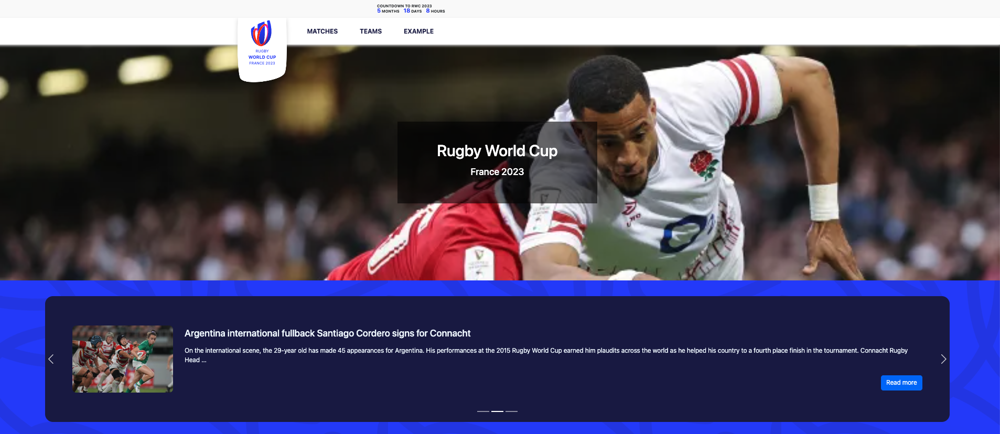
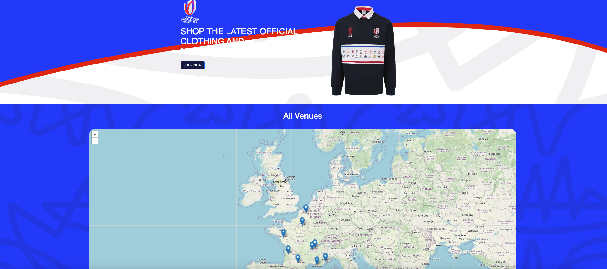
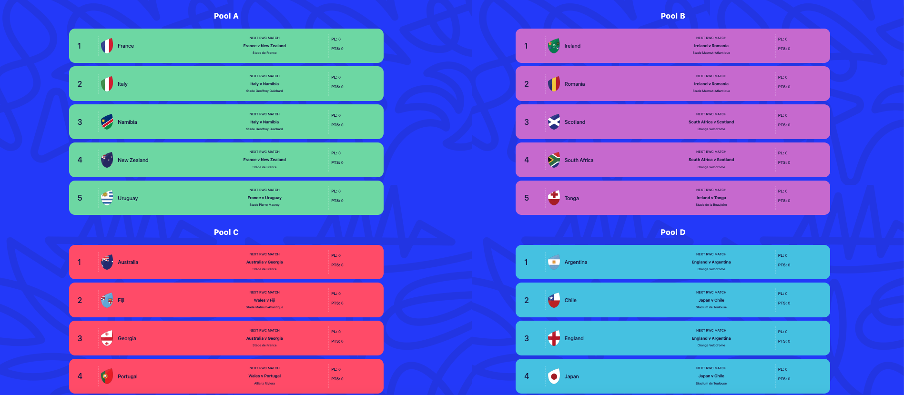
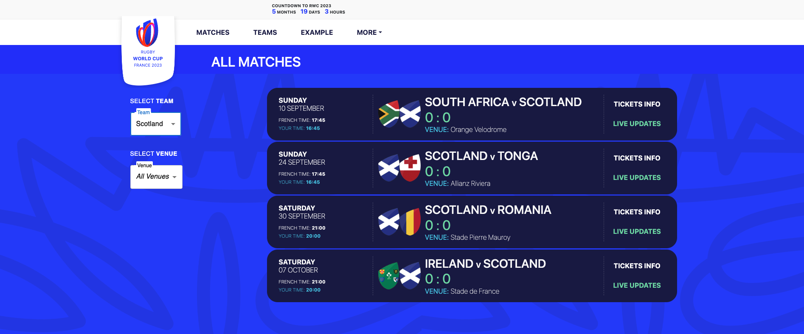
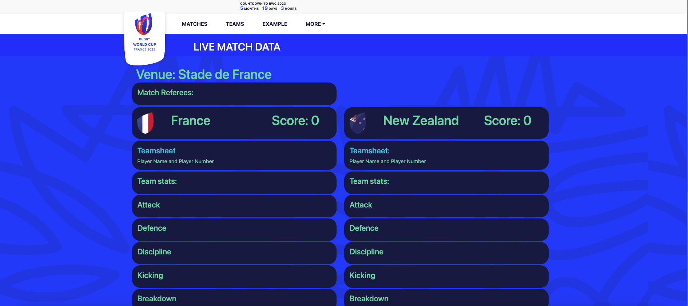

# RWCFrance23 (Rugby World Cup France 2023)
## Description
RWCFrance23 is a React application built as the final project of a 16-week front-end development boot camp by a team of three developers, [Aleksandr Riabov](https://github.com/AleksandrRiabov), [Ainhoa Prada](https://github.com/nowinoa) and  [myself](https://github.com/AlanaBF). The application provides various details about the Rugby World Cup France 2023, including matches, teams, scores, live match updates, pools, venue maps, and filters. Additionally, there are links to the official shop and ticket sales pages.

Overall, the RWCFrance23 application is a comprehensive and visually appealing resource for rugby fans who want to stay up-to-date with the latest information about the Rugby World Cup France 2023. With its user-friendly interface and comprehensive features, this application is a testament to the skills and dedication of its developers.

Deployed Site: https://rwcfrance23.netlify.app/ 

## Technologies Used
The RWCFrance23 application was built using:

- React 18
- react-router-dom
- react-bootstrap
- materialUi
- leaflet
- Rugby Live Data and RugbyApi2 APIs
- Bing news API

## Features
The RWCFrance23 application includes the following features:
- View details about all matches in the Rugby World Cup France 2023.
- View information about participating teams in the Rugby World Cup France 2023.
- Check live match updates.
- View pools.
- View the locations of venues on the map.
- Filter the data.
- Links to the official shop and ticket sales pages.

## Deployment
The RWCFrance23 application is currently deployed on Netlify. The site is automatically deployed every time a commit is pushed to the main branch of the GitHub repository.

## Screenshots

## How to Use
To use the RWCFrance23 application, simply visit the deployed site URL. From there, you can access all of the application's features.

## Installation
To run the application locally, follow these steps:

1. Clone the repository.
2. Run `` npm install `` to install all dependencies.
3. Run `` npm start `` to start the development server.

## What We Learned
During the development of RWCFrance23, our team gained valuable experience in React development, API integration, and collaboration. We learned how to work effectively in a team, how to manage project timelines, and how to overcome challenges encountered during development. Additionally, we gained experience in using various technologies such as React 18, react-router-dom, react-bootstrap, materialUi, leaflets, and Rugby Live Data and RugbyApi2 APIs.

## Contributions
We welcome contributions to the RWCFrance23 application! To contribute, please fork the repository, create a branch for your changes, make your changes, and submit a pull request. We will review your changes and merge them if they meet our standards.

## License
The RWCFrance23 application is released under the MIT License.

